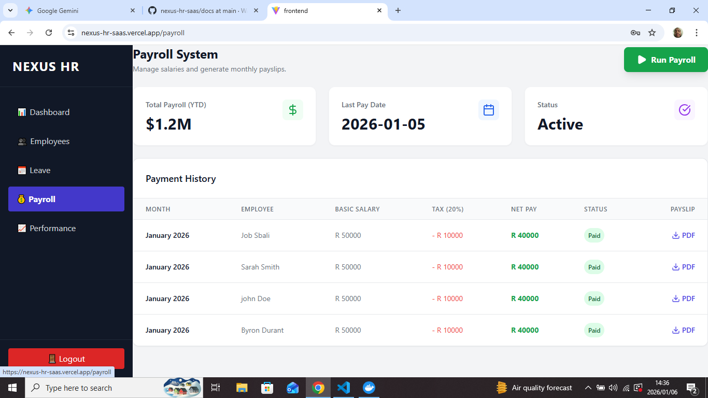
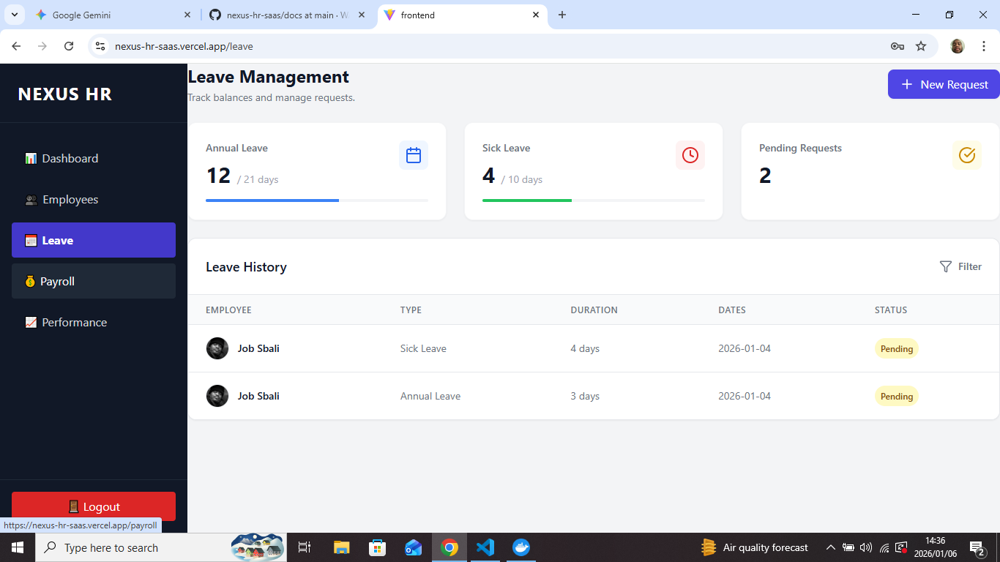
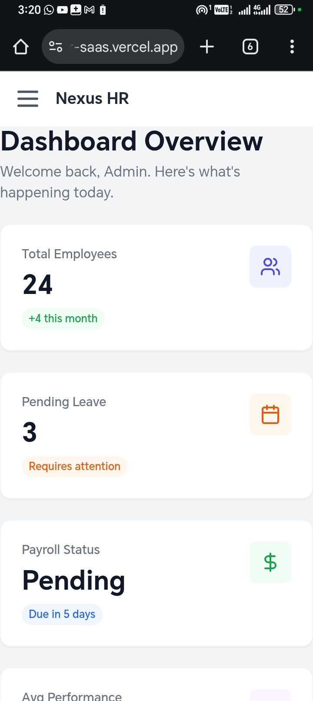

# 🏢 Nexus HR – Full‑Stack HR & Payroll SaaS Platform

> **Production‑ready workforce management system built to demonstrate real‑world SaaS architecture, business logic, and scalable full‑stack development.**

Nexus HR is a complete Human Resources & Payroll management platform designed for small to medium‑sized organizations. It goes beyond CRUD operations by implementing real business rules, secure authentication, and relational data integrity, similar to what real clients require in production systems.

### 🔗 **Live Demo:** [https://nexus-hr-saas.vercel.app/](https://nexus-hr-saas.vercel.app/)

---

## 🎯 Why This Project Matters (Client Perspective)
This project demonstrates my ability to:
* **Design and build** end‑to‑end SaaS applications.
* **Translate business requirements** into reliable software logic.
* **Develop secure, scalable**, API‑driven systems.
* **Deliver clean, responsive**, role‑based user interfaces.

It reflects the type of systems I build for clients: dashboards, internal tools, and SaaS platforms.

---

## 🚀 Core Features

### 🖥️ Interactive Admin & Employee Dashboards
* **Real‑time KPIs:** Total employees, payroll status, pending leave requests.
* **Role‑based UI rendering:** Distinct views for Admin vs. Employee.
* **Responsive layout:** Optimized for desktop and mobile devices.

### 💰 Automated Payroll Engine
* **One‑click payroll processing.**
* **Automatic calculation of:**
    * Gross salary
    * Tax deductions (business rule enforcement)
    * Net pay
* **Safeguards:** Prevents duplicate payroll runs per month.
* **Audit consistency:** Immutable payroll transaction records.

### 📅 Smart Leave Management System
* **Conflict detection:** Backend‑level validation for overlapping leave requests.
* **Balance deduction:** Automatic tracking of Annual / Sick leave balances.
* **Workflow:** Approval & rejection system for managers.
* **Status tracking:** Clear updates for employees.

### 🏢 Employee Management & Directory
* **Secure onboarding** with unique email validation.
* **Dynamic employee profiles** with auto‑generated avatars.
* **Instant client‑side search** and filtering.
* **Clean, readable** employee data presentation.

---

## 🧠 Architecture Overview
Nexus HR follows a decoupled full‑stack architecture, allowing the frontend and backend to scale independently.

* **Frontend:** React SPA consuming REST APIs.
* **Backend:** Django REST Framework handling business logic.
* **Authentication:** JWT‑based with secure token refresh handling.
* **Database:** PostgreSQL enforcing relational integrity.

---

## 🔌 API Architecture: Dual-Protocol Support
Nexus HR implements a hybrid API strategy to demonstrate versatility and performance optimization:

### **1. REST API (Standard)**
* **Use Case:** Web Dashboard & legacy integrations.
* **Tech:** Django Rest Framework (DRF).
* **Endpoints:** Standard CRUD for Employees, Payroll, and Leave.

### **2. GraphQL API (Feature Branch)**
* *Available in the `v2-graphql-api` branch.*
* **Use Case:** Mobile clients & complex data fetching.
* **Tech:** Graphene-Django.
* **Key Capabilities:**
    * **No Over-fetching:** Clients request *only* the specific fields they need.
    * **Nested Queries:** Fetches Employee profile + Payroll History in a **single request**.
    * **Mutations:** Type-safe data creation.

---

## 🛠️ Technology Stack

### **Frontend**
* **React.js (Vite)** – Fast, modern SPA framework.
* **Tailwind CSS** – Responsive, utility‑first styling.
* **Lucide Icons** – Clean, consistent iconography.
* **React Hooks** – Modular state and lifecycle management.
* **Axios** – Centralized API communication.
* **JWT Interceptors** – Secure token refresh & session handling.

### **Backend**
* **Python / Django 5** – Robust backend framework.
* **Django REST Framework** – RESTful API design.
* **JWT Authentication** – Secure access control.
* **PostgreSQL** – Relational database with enforced constraints.

### **DevOps & Infrastructure**
* **Docker & Docker Compose** – Multi‑container orchestration.
* **Environment‑based configuration.**
* **WhiteNoise** – Static asset handling.

---

## 🗂️ Database Design
The database schema is designed around real business constraints, ensuring:
* Referential integrity.
* Accurate payroll calculations.
* Reliable leave tracking.

📊 **ERD Diagram:** `see /docs/erd_diagram.png`

---

## 📸 Application Screenshots

| **Payroll Processing** | **Employee Directory** |
|:---:|:---:|
|  |  |
| *Automated salary calculations* | *Real‑time search & filtering* |

| **Leave Management** | **Mobile Responsive** |
|:---:|:---:|
|  |  |
| *Leave Balance & History* | *Fully functional on mobile devices* |

---

## 🔧 Local Development Setup
This project is fully containerized and can be run locally with a single command.

### Prerequisites
* Docker Desktop
* Git

### Installation

**1. Clone the repository**
```bash
git clone [https://github.com/WANDART291/nexus-hr-saas.git](https://github.com/WANDART291/nexus-hr-saas.git)
cd nexus-hr-saas

2. Start the full stack (frontend + backend + database)

Bash

docker compose up --build

3. Run database migrations

Bash

docker compose exec web python manage.py migrate

Access the Application
Frontend: http://localhost:5173

Backend API: http://localhost:8000/api

🧪 Engineering Highlights
✅ Centralized API error handling and loading states.

✅ Secure authentication lifecycle with token refresh.

✅ Clean separation of concerns between UI and business logic.

✅ Business‑rule validation enforced at the backend level.

🚀 Roadmap
[ ] Frontend migration to TypeScript.

[ ] Improved data‑fetching optimization.

[ ] Advanced role & permission system.

[x] GraphQL API layer (Implemented in v2 branch).

👤 Author
Wandile Khanyile

Full‑Stack Software Engineer

Python • Django • React • GraphQL • PostgreSQL

Built with ❤️ in South Africa